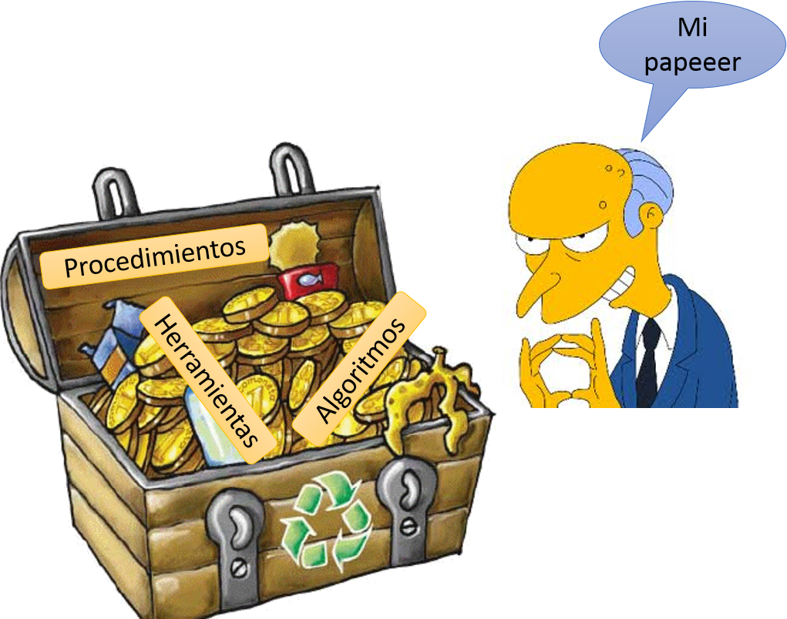
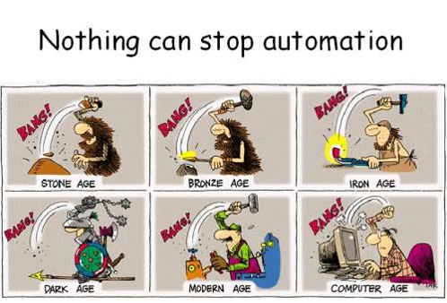
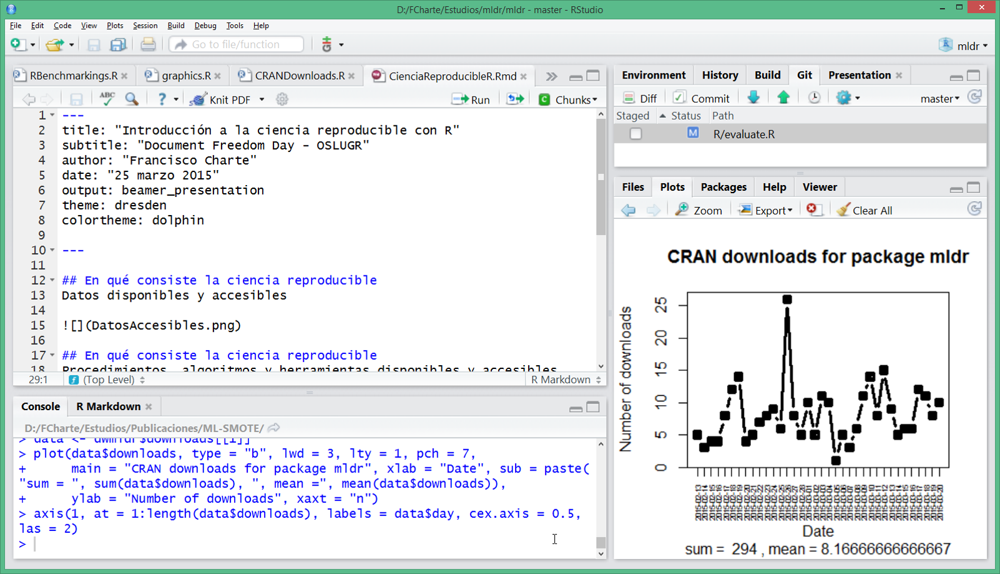
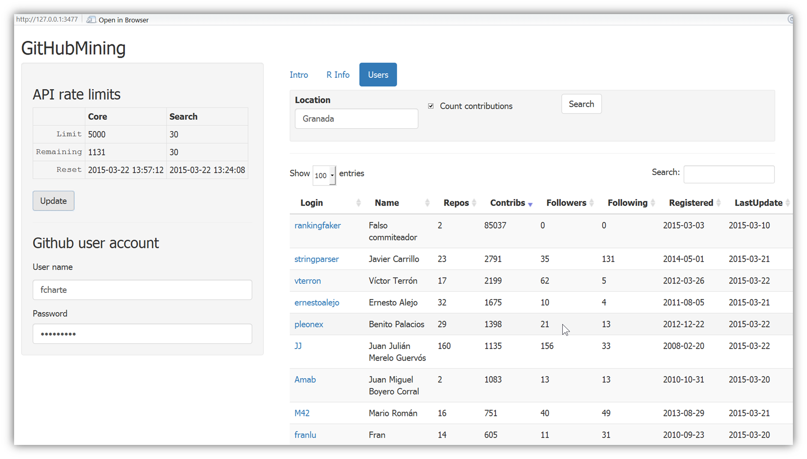
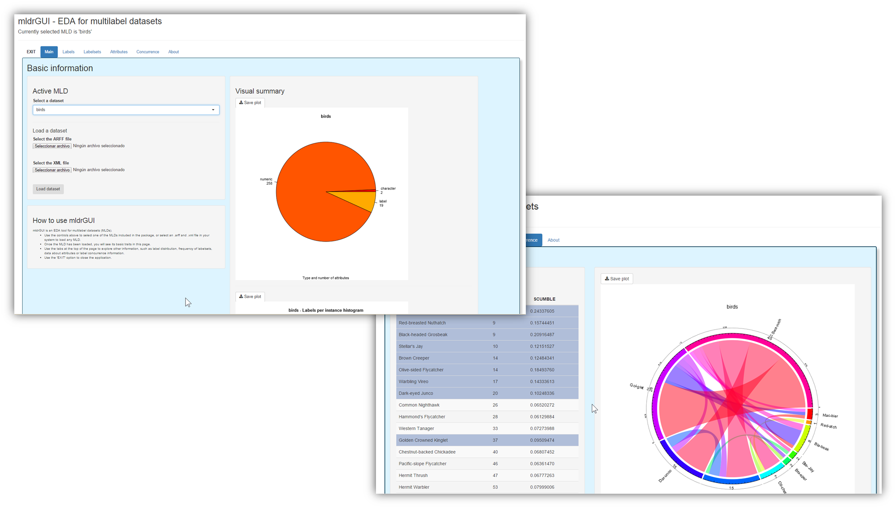
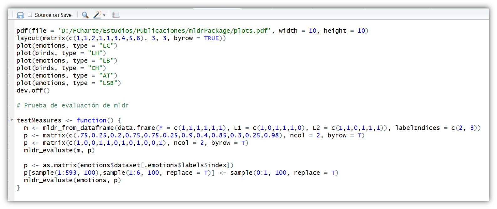
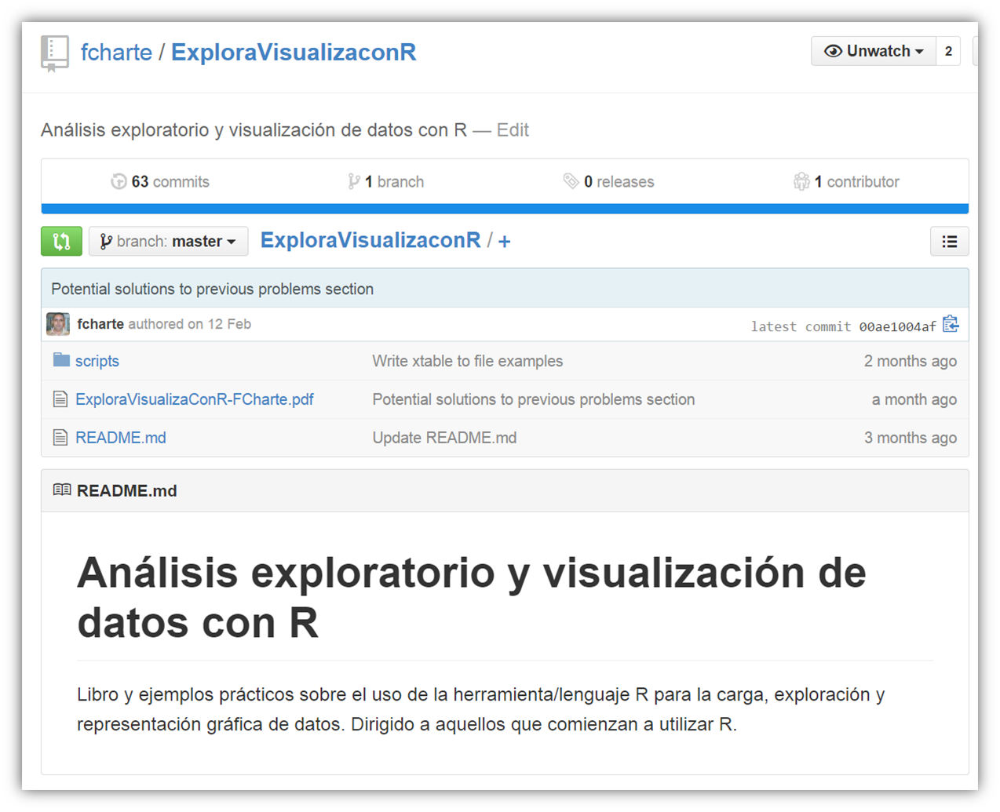
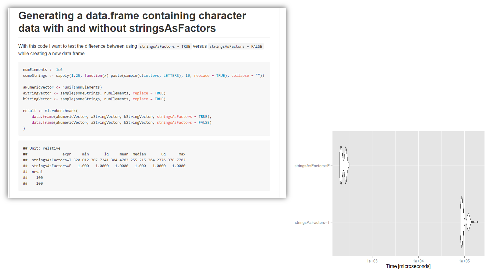

## En qué consiste la ciencia reproducible
Datos disponibles y accesibles

## En qué consiste la ciencia reproducible
Procedimientos, algoritmos y herramientas disponibles y accesibles

## En qué consiste la ciencia reproducible
Las acciones manuales no son fácilmente reproducibles

## Introducción a R

## Importación de datos - Desde archivos

- CSV: `read.table()`
- Paquete `foreign`
    * Stata: `read.dta()`
    * SPSS: `read.spss()`
    * SAS: `read.ssd()`
    * dBase: `read.dbf()`
    * ARFF: `read.arff()`
    * Octave: `read.octave()`
- Excel: `loadWorkbook()` - Paquete `XLConnect`
- OpenOffice/LibreOffice: `read.ods()`- Paquete `ROpenOffice`
- XML: `xmlParse()` - Paquete `XML`

## Importación de datos - Desde bases de datos

- SQLite: `RSQLite`
- Oracle: `ROracle`
- MySQL: `RMySQL`
- PostgreSQL: `RPostgreSQL`
- ODBC/JDBC: `RODBC`/`RJDBC`
- MongoDB: `rmongodb`
- CouchDB: `R4CouchDB`
- Cassandra: `RCassandra`

## Importación de datos - Otras fuentes

- Hadoop: `RHadoop`
- Spark: `SparkR`
- JSON: `jsonlite`
- Web: `parseHTML()` y `readHTMLTable()` - Paquete `XML`
- Web: `GET()` - Paquete `httr`
- Web: `getURL()`y `getForm()` - Paquete `RCurl`

## Importación de datos - Ejemplo
Tags de los posts del foro de cocina de Stack Exchange

\begin{columns}[c] 
\column{.5\textwidth} 
{% start group
\par 
\ttfamily\footnotesize 
library(XML)

library(tm)

library(wordcloud)

content<-xmlTreeParse(filename)

...

docs<-Corpus(VectorSource(content))

docs<-tm\_map(docs, content\_transformer(tolower))

...

wordcloud(DocumentTermMatrix(docs))

\par 
}
\column{.5\textwidth}

\includegraphics{WordCloud.png}

\end{columns}

## Importación de datos - Ejemplo
Datos obtenidos de la API de GitHub en formato JSON
`runGitHub('GitHubMining', 'fcharte')`

## Exploración y análisis - Herramientas interactivas
Fáciles de utilizar - Útiles para explorar

## Exploración y análisis - Scripts
Automatizan tareas - Fácil reproducción (`pdf()`, `xtable()`, etc.)

## Exploración y análisis - Libro y ejemplos

## Exploración y análisis - Documentos reproducibles
[RBenchmarkings](https://github.com/fcharte/RBenchmarkings/blob/master/RBenchmarkings.md)

## Publicación de datos - Presentaciones

